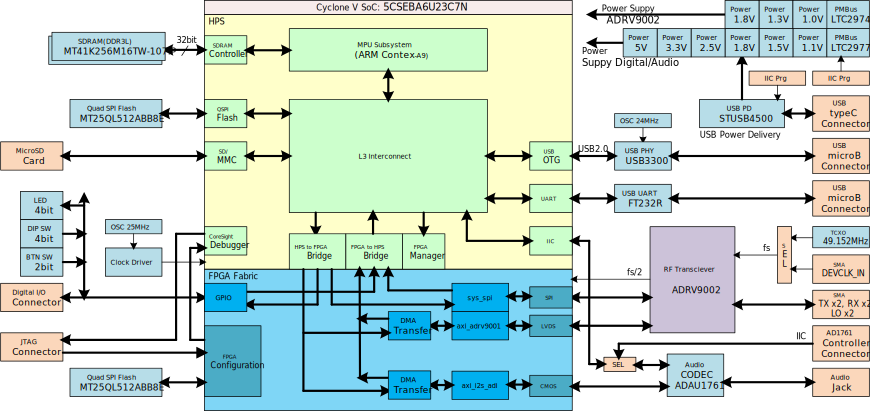
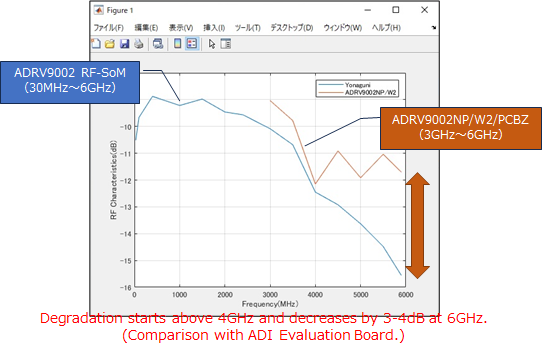

# ADRV9002 RF-SoM

- [ADRV9002 RF-SoM](#adrv9002-rf-som)
  - [**Project Descriptions**](#project-descriptions)
  - [**Hardware Overview**](#hardware-overview)
    - [**Hardware Architecture**](#hardware-architecture)
    - [**Hardware Limitations**](#hardware-limitations)
    - [**ADRV9002 Connectors, Jumper, Switch**](#adrv9002-connectors-jumper-switch)
      - [**RF Ports (CN1 - CN7)**](#rf-ports-cn1---cn7)
      - [**ADRV9002 Interface Selector (J1)**](#adrv9002-interface-selector-j1)
      - [**ADRV9002 Clock Selector (SW1)**](#adrv9002-clock-selector-sw1)
    - [**Cyclone V Connectors, Jumpers, Swithces**](#cyclone-v-connectors-jumpers-swithces)
      - [**JTAG (CN8)**](#jtag-cn8)
      - [**GPIO (CN9)**](#gpio-cn9)
      - [**microSDXC Card Slot (CN10)**](#microsdxc-card-slot-cn10)
      - [**USB 2.0 (CN12)**](#usb-20-cn12)
      - [**USB UART (CN13)**](#usb-uart-cn13)
      - [**Cyclone V Boot Selector (J3)**](#cyclone-v-boot-selector-j3)
      - [**Cyclone V MSEL (SW2)**](#cyclone-v-msel-sw2)
      - [**Reset Switch (SW3 - SW5)**](#reset-switch-sw3---sw5)
      - [**User Defined DIP Switch (SW6)**](#user-defined-dip-switch-sw6)
      - [**User Defined Button Switch (SW7, SW8)**](#user-defined-button-switch-sw7-sw8)
      - [**User Defined LED (D4 - D7)**](#user-defined-led-d4---d7)
    - [**ADAU1761 Connectors and Jumper**](#adau1761-connectors-and-jumper)
      - [**3.5 mm Audio Jack (J5, J6, J8, J9)**](#35-mm-audio-jack-j5-j6-j8-j9)
      - [**ADAU1761 I2C Port (J13)**](#adau1761-i2c-port-j13)
    - [**Power Supply**](#power-supply)
      - [**USB Type-C (CN14)**](#usb-type-c-cn14)
      - [**USB PD IC I2C Port (J10)**](#usb-pd-ic-i2c-port-j10)
      - [**LTC2977/2974 PMBus Power Manager Interface (J11)**](#ltc29772974-pmbus-power-manager-interface-j11)
      - [**LTC2977/2974 PMBus Power Manager Write Protect Pin (J12)**](#ltc29772974-pmbus-power-manager-write-protect-pin-j12)
  - [**Software Overview**](#software-overview)
  - [**Repository information**](#repository-information)
  - [**License**](#license)
  - [**DISCLAIMER**](#disclaimer)


## **Project Descriptions**
  ADRV9002 RF-SoM (Model number: MEC-00689002-EVB, Development code: "Yonaguni") is a Software Defined Radio (SDR) System on Module (SoM) for Analog Devices ADRV9002 Agile Transceiver™ IC.
  The SoM is an Intel Cyclone® V SE SoC FPGA-based single-board that can be used as an evaluation tool and prototyping platform.
  The ADRV9002 2×2 transceiver with integrated DPD engine operates from 30 MHz to 6 GHz and supports narrow-band (kHz) and wideband operation up to 40 MHz.
  Marimo Electronics Co., Ltd. can also support the development of custom versions optimized for specific applications. 


## **Hardware Overview**
  ADRV9002 RF-SoM is a compact RF System on Module (SoM).
  ADRV9002 RF-SoM integrates an Intel Cyclone® V SE SoC FPGA baseband processor, Analog Devices ADAU1761 SigmaDSP® integrated audio codec IC, and power circuits with Analog Devices ADRV9002 Agile Transceiver™ IC.
  
  Board Top View

  
  Board Bottom View
 


### **Hardware Architecture**
  The following shows a block diagram of the ADRV9002 RF-SoM hardware architecture.
  
  For further descriptions, refer ```Yonaguni_HW-Specifications_r2.00.docx``` (current version is only available in Japanese. Now in preparation.)


### **Hardware Limitations**
  The ADRV9002 RF-SoM cannot evaluate all features and performance of the ADRV9002. There are some limitations.
- The RX sampling rate is up to 40Msps and the RX bandwidth is up to 20MHz. This is due to the bandwidth limitations of the LVDS interface of the Cyclone V SoC.
- Current hardware design version showed frequency response degradation at 3.5 GHz and above.


  Note: These are the results based on our measurement method. It may differ from the manufacturer's published value.For detail, please refer to the "Yonaguni_RF_evalution_report.pdf" by Radiun Co., Ltd.(Japanese only)
- External LO feature is not supported in this release. (External LO Inputs are designed from 60MHz to 3GHz, but are currently untested.)
- User cannot use AUXADCs and AGPIOs.


### **ADRV9002 Connectors, Jumper, Switch**
#### **RF Ports (CN1 - CN7)**
| Connector No | Type | Mnemonic | Note |
----|----|----|----
| CN1 | In  | DEVCLK_IN | Device clock input |
| CN2 | Out | TX1_OUT   | Output for transmitter channel 1 (Tx1) |
| CN3 | In  | EXT_LO1   | External LO input 1 (LO1) |
| CN4 | Out | TX2_OUT   | Output for transmitter channel 2 (Tx2) |
| CN5 | In  | EXT_LO2   |  External LO input 2 (LO2) |
| CN6 | In  | RX1A_IN   | Input A for receiver channel 1 (Rx1) |
| CN7 | In  | RX2A_IN   | Input A for receiver channel 2 (Rx2) |


#### **ADRV9002 Interface Selector (J1)**
  Switch between CMOS synchronous serial interface (CSSI) LVDS synchronous serial interface (LSSI).
  This selector switches the IO pin voltage of the SoC that interfaces with the ADRV9002 to 2.5V for LSSI and 1.8V for CSSI.
  In the Cyclone V SoC, the LVDS IO voltage is 2.5V. On the other hand, the ADRV9002 operates at 1.8V for both CSSI and LSSI.
  The SoC is electrically matched to the LVDS of the ADRV9002 after being configured with LVDS.
  However, if the SoC is configured with CSSI while an IO voltage of 2.5V is applied at J1, 2.5V will be applied to the interface and damage the ADRV9002.
  For this reason, in ADRV9002 RF-SoM's HDL reference design, if the SoC is configured with CSSI but 2.5V is applied, the red LED (D2) lights up and indicates the error.
  At this time, the data port of ADRV9002 is protected to be Hi-Z on the SoC side.

#### **ADRV9002 Clock Selector (SW1)**
  You can select either the on-board TCXO or an external source (CN1) as the device clock source for the ADRV9002.
  
  If the clock is supplied from the on-board TCXO, the green LED (D1) lights up.


### **Cyclone V Connectors, Jumpers, Swithces**
#### **JTAG (CN8)**
| Pin No | Type | Mnemonic | Note |
----|----|----|----
| 1 | In | JTAG_TCK | Clock signal |
| 2 | Ground | GND | Signal ground |
| 3 | Out | HPS_TDO | Data from device |
| 4 | Vcc | VCC3P3 | 3.3V power input |
| 5 | In | JTAG_TMS | JTAG state machine control |
| 6 | In | JTAG_RST | JTAG reset |
| 7 | Not Connect | NC | N/A |
| 8 | Not Connect | NC | N/A |
| 9 | In | JTAG_TDI | Data to device |
| 10 | Ground | GND | Signal ground |


#### **GPIO (CN9)**
| Pin No | Type | Mnemonic | Note |
----|----|----|----
| 1 | Ground | GND | Signal ground |
| 2 | Vcc | VCC3P3 | 3.3V power supply |
| 3 | Out | USR_OUT0 | USER_OUT[0] |
| 4 | Out | USR_OUT1 | USER_OUT[1] |
| 5 | Out | USR_OUT2 | USER_OUT[2] |
| 6 | Out | USR_OUT3 | USER_OUT[3] |
| 7 | Out | USR_OUT4 | USER_OUT[4] |
| 8 | Out | USR_OUT5 | USER_OUT[5] |
| 9 | Out | USR_OUT6 | USER_OUT[6] |
| 10 | Out | USR_OUT7 | USER_OUT[7] |
| 11 | Out | USR_OUT8 | USER_OUT[8] |
| 12 | Out | USR_OUT9 | USER_OUT[9] |
| 13 | Out | USR_OUT10 | USER_OUT[10] |
| 14 | Out | USR_OUT11 | USER_OUT[11] |
| 15 | Out | USR_OUT12 | USER_OUT[12] |
| 16 | Out | USR_OUT13 | USER_OUT[13] |
| 17 | Out | USR_OUT14 | USER_OUT[14] |
| 18 | Out | USR_OUT15 | USER_OUT[15] |
| 19 | Ground | GND | Signal ground |
| 20 | Vcc | VCC3P3 | 3.3V power supply |


#### **microSDXC Card Slot (CN10)**
  This board supports microSDXC card.  
  We tested 16 GB microSDHC card and 64 GB microSDXC card operations.

#### **USB 2.0 (CN12)**
  USB OTG Connector, connected to USB1 of FPGA.

  USB Transceiver IC: Microchip USB3300
  
  USB Power Switch: OnSemi NCP380


#### **USB UART (CN13)**
  USB UART Connector, connected to UART0 of FPGA.

  USB to serial UART interface IC: FTDI FT232R

  Green LEDs (D11, D12) indicate that UART communication is in progress.
  For Tx (ADRV9002 RF-SoM to PC), D12 lights up. For Rx (PC to ADRV9002 RF-SoM), D11 lights up.


#### **Cyclone V Boot Selector (J3)**
  You can select the boot source from QSPI Flash Memory or SD card by [QSPI/SD].


#### **Cyclone V MSEL (SW2)**
| bit | Signal name | Note |
----|----|----
| 1 | MSEL[0] | 0:ON, 1:OFF |
| 2 | MSEL[1] | 0:ON, 1:OFF |
| 3 | MSEL[2] | 0:ON, 1:OFF |
| 4 | MSEL[3] | 0:ON, 1:OFF |
| 5 | MSEL[4] | 0:ON, 1:OFF |
| 6 | N/A | |

  In ADRV9002 RF-SoM, MSEL[4..0] is set to 00100.
  For further descriptions, refer Cyclone V Device Handbook.

  When FPGA fabric configuration is completed successfully, the green LED (D3) lights up.


#### **Reset Switch (SW3 - SW5)**
  | Switch No | Type | Mnemonic | Note |
----|----|----|----
| SW3 | Input | FPGA Reset | FPGA Hard Reset |
| SW4 | Input | HPS Reset | HPS Reset |
| SW5 | Input | HPS Warn Reset | HPS Warn Reset |


#### **User Defined DIP Switch (SW6)**
| bit | Signal name | Note |
----|----|----
| 1 | USER_DSW[0] | 0:ON, 1:OFF |
| 2 | USER_DSW[1] | 0:ON, 1:OFF |
| 3 | USER_DSW[2] | 0:ON, 1:OFF |
| 4 | USER_DSW[3] | 0:ON, 1:OFF |


#### **User Defined Button Switch (SW7, SW8)**
  | Switch No | Type | Mnemonic | Note |
----|----|----|----
| SW7 | Input | USER_BSW[0] | 0:ON, 1:OFF |
| SW8 | Input | USER_BSW[1] | 0:ON, 1:OFF |


#### **User Defined LED (D4 - D7)**
  Blue LEDs are connected to LED0-3. As default, all LEDs light up (USER_LED[3..0] is 0000).


### **ADAU1761 Connectors and Jumper**
#### **3.5 mm Audio Jack (J5, J6, J8, J9)**
| Jack No | Type | Mnemonic | Note |
----|----|----|----
| J5 | Out | HP_OUT | Headphone output |
| J6 | Out | LINE_OUT | Line output |
| J8 | In | MIC_IN | Microphone input.  |
| J9 | In | LINE_IN | Line input |

  When using a stereo mic, short the MIC BIAS (J7).

#### **ADAU1761 I2C Port (J13)**
  To program the ADAU1761 from SigmaStudio using the EVAL-ADUSB2EBZ, set SW9 from "NORM" to "PGM" while power is applied.
  
  Refer to the following documents.
  
  https://www.analog.com/en/app-notes/an-1006.html
  
| Pin No | Type | Mnemonic | Note |
----|----|----|----
| 1 | In | AC_DL_SCL | I2C SCL |
| 2 | Ground | GND | Ground |
| 3 | In/Out | AC_DL_SDA | I2C SDA |


### **Power Supply**
#### **USB Type-C (CN14)**
  In order to operate ADRV9002 RF-SoM, a USB PD AC adapter capable of 9V/3A (≥27W) is required.
  
  When using USB PD as a power source, J14 is always short.
  
  When power is supplied, the amber LED (D15) lights up.


#### **USB PD IC I2C Port (J10)**
  To program USB PD IC(STUSB4500), use this I2C Port.
  
  However, ADRV9002 RF-SoM users typically do not program the STUSB4500.
  
| Pin No | Type | Mnemonic | Note |
----|----|----|----
| 1 | In | PD_SCL | I2C SCL |
| 2 | Ground | GND | Ground |
| 3 | In/Out | PD_SDA | I2C SDA |


#### **LTC2977/2974 PMBus Power Manager Interface (J11)**
  To program LTC2977/TC2974, use this I2C Port.
  
| Pin No | Type | Mnemonic | Note |
----|----|----|----
| 1 | In | I3P3 | 3.3V Power input |
| 2 | In | PM_SCL | I2C SCL |
| 3 | Ground | GND | Ground |
| 4 | In/Out | PM_SDA | I2C SDA |


#### **LTC2977/2974 PMBus Power Manager Write Protect Pin (J12)**
  If short J12, WP pin of LTC2974/2977 become low, and LTC2977/TC2974 is ready for programming.
  
  Normally J12 is open and used with the LTC2977/TC2974 write-protected.

  For more information about write protection function refer LTC2974/2977's datasheet.


## **Software Overview**
We provide FPGA design, HDL IP, Linux Kernel source code, and sample demo project.

[FPGA design files](https://github.com/MarimoElectronics/Yonaguni-FPGA)  
[HDL IP modified from ADI HDL project](https://github.com/MarimoElectronics/Yonaguni-FPGA/tree/main/yonaguni_cmos_linux/ip/hdl)  
[Linux Kernel source code patch for ADI Kuiper Linux](./kernel_patch/linux_kernel_diff.patch)  


## **Repository information**
This repository contains BOM files, schematics, how to customize operating system.
```
How-toKernel.md
How-toSD.md
How-toUBoot.md
README.md
Yonaguni_Rev2_BOM_r1.09.xlsx
Yonaguni_Schematic_r2.02.pdf
device_tree/yonaguni_cmos.dtb
device_tree/yonaguni_cmos.dts
device_tree/yonaguni_cmos-rx2tx2.dtb
device_tree/yonaguni_cmos-rx2tx2.dts
```
To prepare bootable linux SD card image, prease refer [How-to: Make ADRV9002 RF-SoM SD Card Image](./How-toSD.md).


## **License**
Copyright (c) 2023 Marimo Electronics Co., Ltd.

Permission is hereby granted, free of charge, to any person obtaining a copy of this software and associated documentation files (the “Software”), to deal in the Software without restriction, including without limitation the rights to use, copy, modify, merge, publish, distribute, sublicense, and/or sell copies of the Software, and to permit persons to whom the Software is furnished to do so, subject to the following conditions:

The above copyright notice and this permission notice shall be included in all copies or substantial portions of the Software.

However, some of the software published in this repository is copyrighted by Analog Devices, Inc. These are subject to Analog Devices' license terms and disclaimers, which you should refer to.
  
  https://github.com/analogdevicesinc/linux/tree/master/LICENSES
  
  https://github.com/analogdevicesinc/hdl/tree/master


## **DISCLAIMER**
THE SOFTWARE IS PROVIDED “AS IS”, WITHOUT WARRANTY OF ANY KIND, EXPRESS OR IMPLIED, INCLUDING BUT NOT LIMITED TO THE WARRANTIES OF MERCHANTABILITY, FITNESS FOR A PARTICULAR PURPOSE AND NONINFRINGEMENT. IN NO EVENT SHALL THE AUTHORS OR COPYRIGHT HOLDERS BE LIABLE FOR ANY CLAIM, DAMAGES OR OTHER LIABILITY, WHETHER IN AN ACTION OF CONTRACT, TORT OR OTHERWISE, ARISING FROM, OUT OF OR IN CONNECTION WITH THE SOFTWARE OR THE USE OR OTHER DEALINGS IN THE SOFTWARE.
